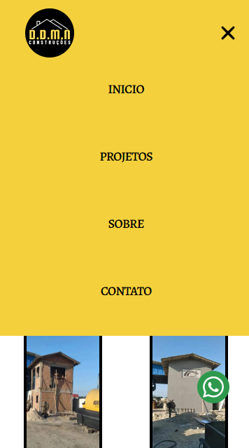

## Next js 14 + Typescript + Tailwind

### 🏷️ About 
My first paid website.
A website for a construction company, which has integration with Google maps, contact form, and popup images.

### 💡 Functionalities 

* Next.js 14 App Router and Server side Rendering.
* API Consumption: Google Maps.
* Contact Form
* Popup Images
* Well-organized file and folder structure.
* Clean code.
* Responsive.

###  🛠️ Built with

* Next 14
* Typescript
* Tailwind
* Git/GitHub

### 🌐 Website
:link: Link to access the website: [https://bricklayer-project.vercel.app/](https://bricklayer-project.vercel.app/)

### 📸 Screenshots

### Layout Desktop

***

***

### Layout Mobile
 
***

***

### ✒️ Author
## :raising_hand: Thiago Alves

- Linkedin - [Thiago Alves](https://www.linkedin.com/in/thiago-alves-010915274/)
- GitHub - [Thiago87dev](https://github.com/Thiago87dev)
- Frontend Mentor - [@MrThiago87](https://www.frontendmentor.io/profile/MrThiago87)
- Instagram - [@thiagopaulista87](https://www.instagram.com/thiagopaulista87/)